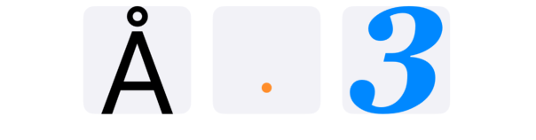
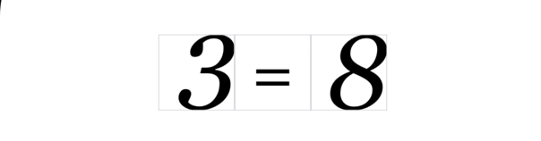

# GlyphKit

Render any font glyph into a SwiftUI view with point-precise sizing — tight to the path or baseline-aligned.


## Features

- Extracts vector glyph outlines via Core Text — no UILabel, no text rendering pipeline
- **Tight sizing** — glyph fills the container edge to edge, regardless of font metrics
- **Typographic sizing** — glyph is placed relative to ascent and descent, preserving visual weight within the font
- Point-precise control over glyph bounds
- No baseline shifts, no Dynamic Type interference
- Anchor and offset control for fine-grained placement
- Ideal for grid-based layouts:  notebook-style arithmetic UI, symbol displays

## Requirements

- iOS 17+
- Swift 6

## Installation

### Swift Package Manager

In Xcode: **File → Add Package Dependencies**

Enter the repository URL:
```
https://github.com/MaksimG82/GlyphKit
```

Or add directly to `Package.swift`:

```swift
dependencies: [
    .package(url: "https://github.com/MaksimG82/GlyphKit", from: "1.0.0")
]
```

## Quick Start


```swift
import GlyphKit

// Tight — glyph fills the frame completely
GlyphView("Å")
    .frame(width: 80, height: 80)

// Typographic — preserves proportions within the font's vertical metrics
GlyphView(".",
    layout: GlyphLayout(sizing: .fontMetrics, anchor: .center, offset: .zero),
    color: .orange
)
.frame(width: 80, height: 80)

// Custom font, custom color
GlyphView("3",
    font: .system(.georgia, isBold: true, isItalic: true),
    layout: .default,
    color: .blue
)
.frame(width: 80, height: 80)
```

## Sizing Modes

| Mode | Description |
|------|-------------|
| `.tight` | Glyph path fills the container exactly. Small symbols like `.` or `-` scale up to fill the frame. |
| `.fontMetrics` | Glyph is placed within the full ascent + descent range. Small symbols stay small, preserving their visual weight relative to other characters. |

## Use Case — Notebook Grid


GlyphKit is well suited for grid-based educational UIs where glyphs must sit precisely within fixed cells — for example, an arithmetic notebook where digits and operators are rendered into a ruled or squared grid:

```swift
    let items: [(Character, GlyphSizing)] = [
        ("3", .tight),
        ("=", .fontMetrics),
        ("8", .tight)
    ]
    
    HStack(spacing: 0) {
        ForEach(items, id: \.0) { digit, sizing in
            GlyphView(digit,
                font: .system(.georgia, isItalic: true),
                layout: GlyphLayout(
                    sizing: sizing,
                    anchor: sizing == .tight ? .trailing : .center,
                    offset: .zero
                ),
                color: .primary
            )
            .frame(width: 56, height: 56)
            .border(Color(.systemGray4), width: 0.5)
        }
    }
    .padding()

```

## Documentation

Full documentation is available at [MaksimG82.github.io/GlyphKit](https://MaksimG82.github.io/GlyphKit)

## License

GlyphKit is available under the MIT license.
